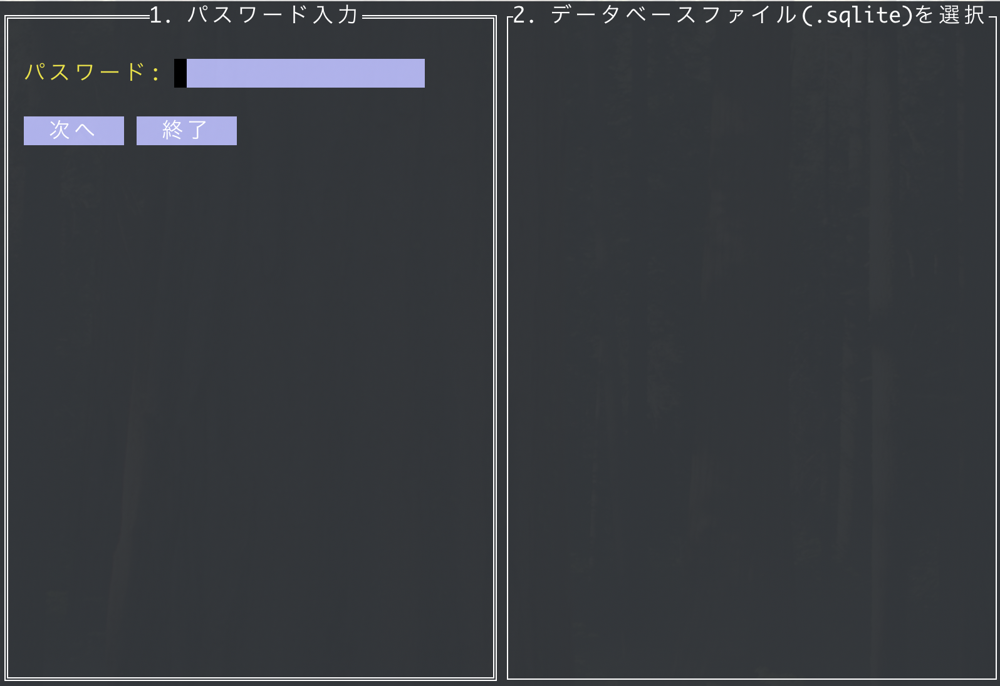

# Password-Checker-TUI

## 概要
`password-checker-TUI` は、医療データの匿名化を支援するTUI（Text-based User Interface）アプリケーションです。
本ツールは、CSVファイルに含まれる患者IDをSHA256でハッシュ化し、匿名化します。


## 特徴
- **TUIによる操作**: `tview` を使用した直感的なインターフェース
- **SHA256ハッシュによる匿名化**: CSVデータ内の患者IDをハッシュ化
- **ログ管理**: `.env` で指定されたフォルダにログを出力

## 環境
- Go 1.22.1
- github.com/joho/godotenv v1.5.1
- github.com/mattn/go-sqlite3 v1.14.24
- github.com/rivo/tview v0.0.0-20241227133733-17b7edb88c57
- golang.org/x/text v0.15.0

## インストール
```sh
git clone repo.git
cd setup
sh build.prod.sh
# setupフォルダをUSBメモリ等に全てコピー
# USBメモリをPCに挿す
cd /media/user-name/usb-name/setup
sh install.sh
cp anonymize-mfer.desktop ~/Desktop/
# デスクトップのアイコンを右クリックして"Allow launching"をクリック
```

## `.env` 設定
アプリケーションを動作させるために `.env` ファイルを作成し、以下の内容を設定してください。

```
ANNONYMIZED_DATA_DIR=./output
LOG_FILE_DIR=./logs
LOG_FILE_NAME=app.log
CURRENT_DIR=./data
```

## 使い方
1. デスクトップのアイコンをクリックしてアプリケーションを起動します。
2. パスワードを入力（ハッシュ化の鍵として使用）
3. CSVファイルを選択
4. MWFフォルダを選択
5. 匿名化処理を実行
6. 処理完了後、匿名化されたデータが `ANNONYMIZED_DATA_DIR` に保存

## ログ管理
アプリケーションのログは `LOG_FILE_DIR` に指定されたフォルダに記録されます。
